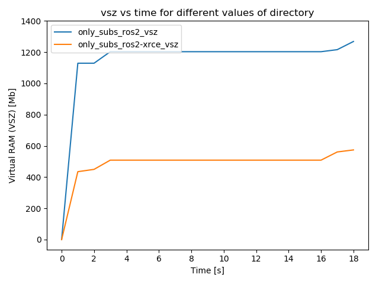
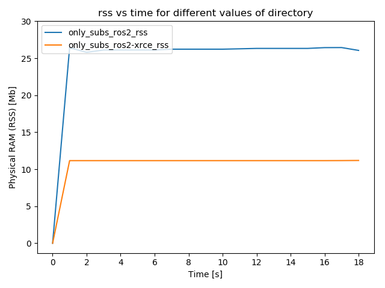

### Micro XRCE DDS

Preliminary results using MicroROS: https://micro-ros.github.io/

* **Installation:** at the time of testing, only the `develop` branch supported ROS2 Crystal. You'd need to follow the instructions at [the wiki](https://github.com/micro-ROS/micro-ROS-doc/blob/develop/Installation/Linux_WSBuild%26Install.md), but in step 2 ("**Import Micro-ROS packages**") - instead of getting the .repos files from `master`, get them from `develop`. 
  * **rmw_microxrcedds.config:** I built MicroROS with the following configuration:
  ```CONFIG_MICRO_XRCEDDS_TRANSPORT=udp
     CONFIG_IP=127.0.0.1
     CONFIG_PORT=8888
     CONFIG_MICRO_XRCEDDS_CREATION_MODE=xml
     CONFIG_MAX_HISTORY=4
     CONFIG_MAX_NODES=10
     CONFIG_MAX_PUBLISHERS_X_NODE=5
     CONFIG_MAX_SUBSCRIPTIONS_X_NODE=10
     CONFIG_RMW_NODE_NAME_MAX_NAME_LENGTH=128
     CONFIG_RMW_TOPIC_NAME_MAX_NAME_LENGTH=50
     CONFIG_RMW_TYPE_NAME_MAX_NAME_LENGTH=128
     ```
  * **Running experiments:** the easiest way is to clone this repository into `microros/client_ws/src` and build everything (microROS & performance_test) together.
* **Note:** at the moment, this performance framework does not measure the resources consumed by the uROS agent, so this is not the whole picture. We'll need to make some adjustments and rerun the experiment if we want to compare apples to apples.
#### only_subs, 4mb, FastRTPS vs. Micro-XRCE-DDS
```
source env.sh
export MAX_PUBLISHERS=1
export MAX_SUBSCRIBERS=1
export MSG_TYPES="4mb"
export DURATION=10
export NUM_EXPERIMENTS=5
bash scripts/only_subs.sh
```



